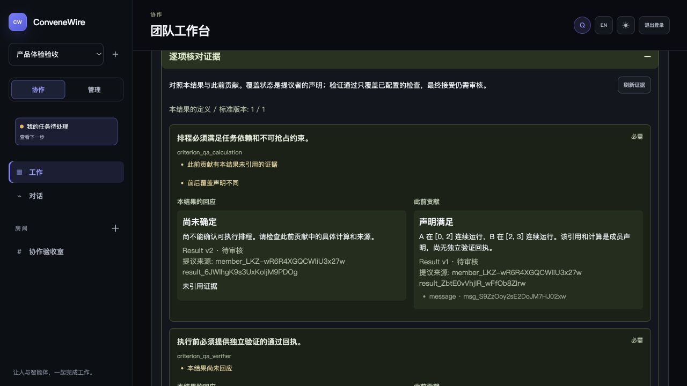
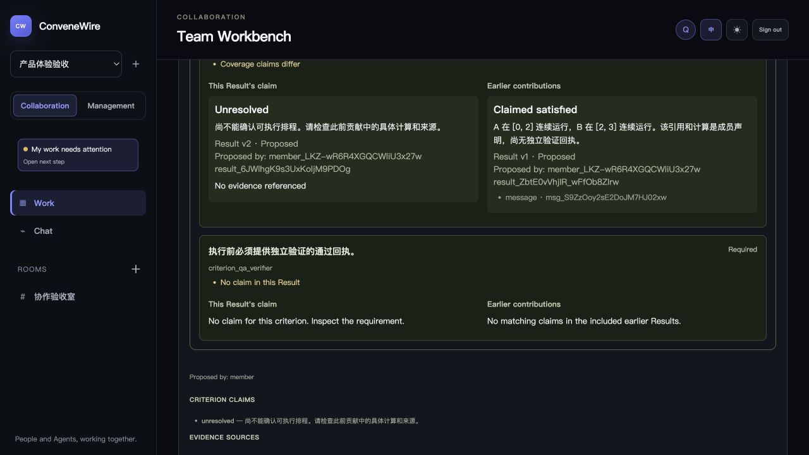
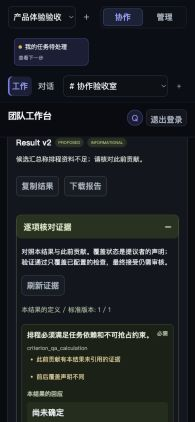

# QA-071 Criterion Evidence Delivery

## Goal and scope

The Owner authorized implementation on 2026-09-06 after reviewing the evidence
collaboration proposal. [ADR-0046](../adr/0046-connect-criteria-contributions-and-verification.md)
freezes the first slice: connect existing Task criteria, immutable Result
contributions, sealed code candidates and independent verification. Delivery
state belongs only to [TASKS.md](../TASKS.md).

The first implementation is a read-only evidence projection used by Result
review and Discussion instructions. It detects structural gaps: an unanswered
criterion, earlier references omitted from the current claim, differing coverage
claims and a satisfied claim without evidence. It cannot determine which prose
claim is correct. There is no new contribution store, verification executor,
review Wave, model call, permission grant or automatic human acceptance.

## Implemented behavior

- An additive closed response definition in the existing work contract leaves
  proposal and Bridge envelopes unchanged. The no-store Result endpoint checks
  current Room access before returning evidence.
- Every criterion at the Result's original revision remains visible, including
  missing claims. Earlier Results must match Task, Room, definition and criteria;
  the latest ten are included with an exact omitted count. Rejected and
  superseded history remains labeled and does not drive support diagnostics.
  Sources compare real identities, not proposal-local reference aliases.
- Artifact checks rejoin the exact source Run, content digest/size/type,
  checkpoint, candidate commit/tree, input, frozen plan/node and verifier profile.
  Only matching required profiles with a single passed receipt per profile can
  show required checks passed. Failed, timed-out, canceled, unknown, incomplete,
  optional, foreign or mismatched checks cannot acquire that meaning.
- Discussion only indexes matching Results attributable to accepted prior
  member Runs and explicitly cited in those accepted turns' `newEvidenceRefs`.
  Same-Wave, quorum-excluded, uncited and supplemental late Results are excluded.
  The index is bounded within the existing 20,000-code-point Run instruction,
  records omissions and unstructured contributions, and remains frozen across
  restart/retry. The existing decision checklist and role protocol are retained.
- Work → Task → Results exposes **逐项核对证据 / Review evidence by criterion**.
  The lazy panel separates current and earlier claims, source IDs, historical
  revisions and candidate verification details. It supports refresh, safe error
  messages and render-time fences for changed Result/Task/member/session scope.

## Verification evidence

Implementation commits are `53bb75c` (goal/ownership), `be65521` (contract),
`47d422e` (Server), `c29dad6` (Discussion), and `839b712` (Web/fixture).
The final code passed the following checks on macOS with Node 22.23.1 and the
repository-pinned Go toolchain. Results count top-level and nested Node tests
as reported by each runner; Go package checks are separate.

| Check | Observed evidence |
| --- | --- |
| `npm test` | 1,222 Node checks passed, zero failed/skipped; includes 625 Server, 311 Web, 101 contracts, Bridge UI, QA fixtures, site, temporary lifecycle and all synthetic Discussion/workspace/complex suites; generated/type checks and contracts Go packages pass |
| `npm run test:e2e` | Nine deterministic cross-process checks pass; one live Codex/Pi case intentionally skipped; no external model invocation |
| `npm run build` and final Web rebuild | Server, Web and contracts pass; existing Vite large-chunk advisory remains |
| `npm run validate` | 14 schemas and 266 shared fixtures pass |
| Focused Result/capture tests | 32 pass: membership, exact source identity, stale criteria, history bounds, restart, candidate substitution, passed/failed/unknown outcomes and no-side-effect reads |
| Real Server/Go capture/verifier path | Six counted checks pass: actual Git bytes, lost responses, process restarts and real pass/fail/timeout verifier receipts; new evidence inspection checks the resulting candidate status |
| Focused Discussion/Result tests | 56 pass: accepted/offered attribution, exclusions, frozen retry/restart input, Unicode limits, secret redaction and omission counts |
| Focused Web/Task tests and disposable seed | 19 Web checks and three API fixture checks pass: both locales, all candidate states, unsafe authored text, missing claims, identity mismatch, denial/retry and stale response fencing |
| `npm run lint:docs`, `git diff --check` | Pass after the final acceptance documentation update |

Full `npm test` includes the focused Server/Go tests above; these are detailed
evidence subsets, not additional independent trials. Synthetic benchmark test
names still contain historical wording such as “real”; the invoked commands
set `CONVENE_WIRE_BENCH_SYNTHETIC=1` and never run the live benchmark commands.

During development, one focused Web invocation from the repository root used
the wrong JSX configuration and failed in an existing component. Running from
`apps/web` with its normal configuration passed all 19 checks, and the complete
workspace command passed all 311. A seed assertion was also corrected to match
the intended rule: an unresolved claim is allowed to have no reference; the
`claim_without_evidence` diagnostic applies to claimed satisfaction.

## Built-page inspection

The disposable trusted-Team preview used the built Web assets with the real
Fastify/SQLite endpoint. Its synthetic TASK-109 contains two ordinary Results:
the earlier one cites a calculation, while the later unresolved claim omits
that reference. The expanded panel displayed both the lost-reference and
changed-coverage diagnostics, retained the attributed earlier calculation and
showed the second unanswered criterion separately. The seed does not implement
a scheduling verifier or claim that the synthetic calculation was validated.

The Chinese and English views were inspected at the default 1280 px desktop
width. At a 390 × 844 CSS viewport, page `scrollWidth` and viewport width both
equaled 390; each panel's `clientWidth` and `scrollWidth` equaled 324. The
comparison stacked into one 282 px column, source IDs wrapped, both contribution
sections were reachable, and criterion headings rendered at 14 px. No console
error was recorded during active preview inspection. The browser's narrow
capture renders at half scale; the retained 195 × 422 crop removes its unused
canvas and does not change the tested CSS viewport.

The preview was then stopped, the temporary browser viewport override reset and
the temporary tab closed. All 15 owned roots observed in this slice's test logs
were physically absent after cleanup, including the full-suite, E2E, real Go
verifier and preview roots. Both preview listeners were absent. Unrelated older
preview processes were left untouched.

## Limits and next evaluation

This establishes an inspectable evidence path, not better model answer quality,
semantic truth or production/physical Windows acceptance. The first verifier
projection covers existing governed code candidates and registered local checks;
it does not add scheduling, log-normalization or arithmetic validators.

Fact-transfer rate, correct-information retention and net correction still need
an independently labeled, preauthorized experimental set. The new structural
diagnostics must not be reported as those semantic metrics. A later experiment
should freeze contributions, source permissions, role/prompt, model and resource
budgets before comparing outcomes. Historical experiment plans remain consumed.
