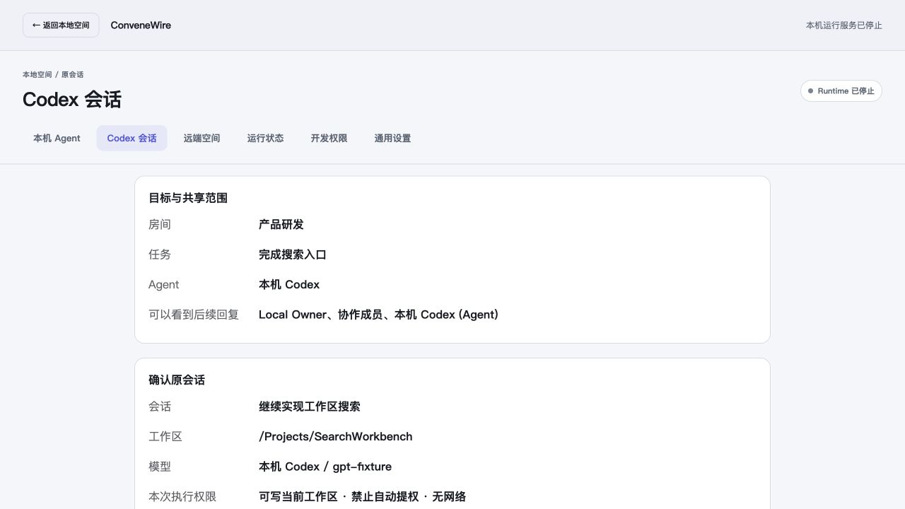
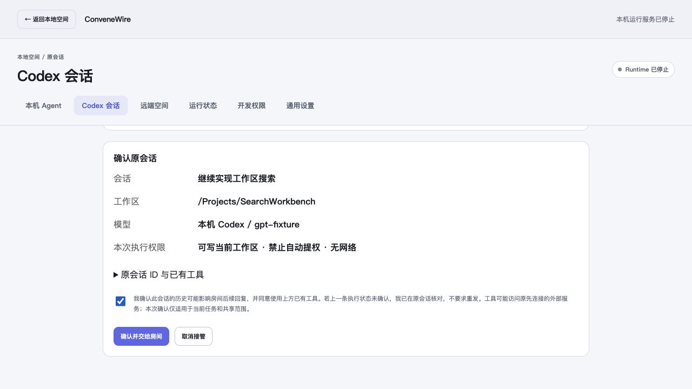
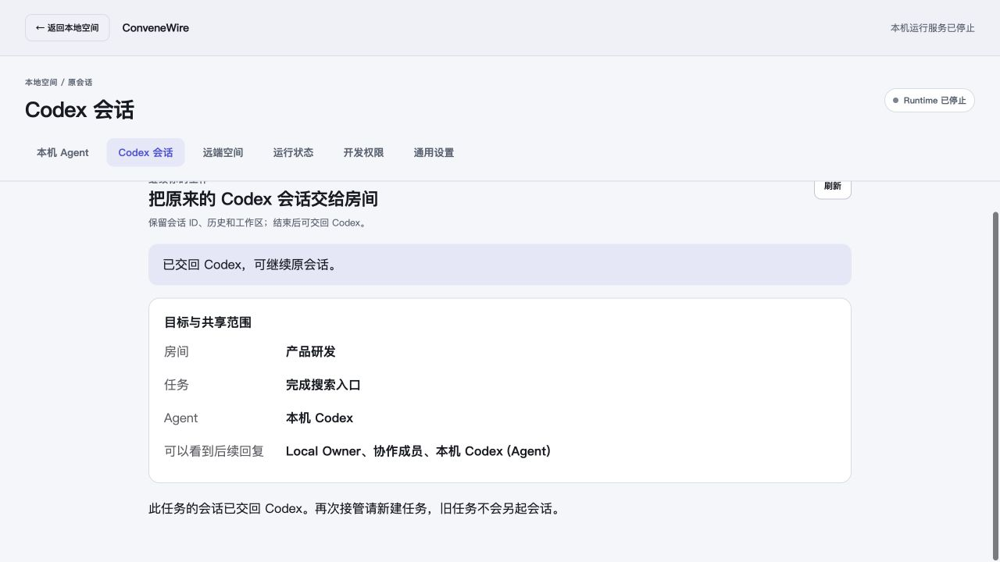

# QA-094: Original desktop Codex conversation through a Room

Date: 2026-09-20. Scope: ADP-021 / WEB-091 local macOS implementation of
[ADR-0072](../adr/0072-hand-off-desktop-codex-sessions.md). Delivery state is recorded
only in [TASKS.md](../TASKS.md).

## Observed integration

The installed native provider completes an actual Local Hub Task Run through the
production Bridge inbox, Runtime adapter, native coordinator and original-client
mediator. The fixture's original Thread contains a private synthetic context
anchor and a dynamic tool handled by the original desktop client. The Room turn
uses both without changing Thread ID, workspace or handler. Only the exact new
final reply appears in the Room; native IDs and the private anchor are absent from
Bridge events. Replaying the durable delivery makes no additional model request.

The owner must explicitly check disclosure consent. Canceling the initial review
leaves the same fresh Task available. After execution, coordinator restart restores
the same binding paused; renewed local review permits return. The original client
then continues the same Thread, which retains its three turns. Four deterministic
Responses requests are handled by an auth-free loopback fixture; there are zero
paid-provider calls and no owner conversation is inspected.

`codex-room-handoff.test.ts` supplies a test-only original desktop client on the
real installed native binary. The separate actual Electron startup fixture proves
the installed app initializes through the packaged proxy/mediator with a disposable
profile, refuses duplicate launch and drains its processes. These are complementary
checks, not a claim that the owner manually clicked the entire flow in Codex.

Tested binaries:

- Codex desktop: `26.915.31945`, macOS arm64.
- Native provider: `0.155.0-alpha.9.2`.
- Desktop executable SHA-256: `dfe5654498e939d355702fa66e6e2400e55ec0ade61048e19e264f4bdc70b847`.
- Desktop archive SHA-256: `1f7939c1c781887c167043c4d1d307af3400d324685cfc315dfe2f80e634f483`.
- Native provider SHA-256: `9280c0754e8f1f6b72f495d30c8c82a006dbc4995bf0492916fa0901f6bfd1f9`.

## Boundaries exercised

- The Hub accepts consent only through its authenticated native control channel;
  browser-origin, owner-browser-token, unknown field and stale-audience attempts
  fail. The Hub stores qualified destination IDs and an opaque adoption marker,
  never source history, native ID, private title or workspace.
- Changed Room audience/assignment blocks dispatch and content publication. A
  delivery retains its original audience pin after later renewed consent. Ordinary
  Run status settlement remains possible without releasing private content.
- Unix control rejects missing/wrong capabilities, foreign origins, duplicate JSON
  members, unknown fields and arbitrary native RPC names. One OS lease owns the
  descriptor. Shutdown and stale-owned-socket recovery preserve another connection.
- Original desktop writes are fenced; read inspection and original tool callbacks
  remain available. Foreign queue activity pauses the fence. Reordered native
  events and duplicate operation IDs cannot publish another turn's text.
- Workspace-write is restricted to the reviewed directory, no native network,
  no temporary-root write expansion and `approvalPolicy: never`. Changed workspace
  and full-access requests fail. Interrupt requires the exact owned native turn ID.
- A missing original connection never starts a replacement. Protected journals
  reject foreign Node identity and unsafe permissions. Unknown submission is never
  resent; pending execution retains the scheduling fence across restart.
- Durable `releasing` intent survives a lost Hub acknowledgment. Retry finishes the
  same return. A provisional cancellation removes its reservation; confirmed
  adoption retains a no-fallback tombstone, including a lost confirm acknowledgment.
- Native JSON member ordering does not invalidate a review. Changed checkpoint or
  runtime authority still does. Final Room status contains valid logical coverage
  without leaking a native session identifier.

## Native review UI

The actual embedded Console was opened in the in-app Browser against the opt-in
synthetic local fixture. Selection, source details, audience display, initially
unchecked consent, confirmation and return were clicked. Titles use text nodes;
source metadata is confined to the authenticated native page. The temporary browser
tab and fixture were closed after inspection.

## Reproducible checks

Commands and fixture boundaries are in
[Development commands](../development-commands.md#desktop-codex-room-integration).
The following checks were run against this implementation:

- Contracts: 139 JavaScript tests; 281 shared golden vectors, including paired
  adoption/audience and required Task negatives; deterministic generation, strict
  TypeScript and Go contract tests pass. Local-control vectors are shared by Go
  and TypeScript.
- Native compatibility: fourteen installed-provider cases and two original-client
  mediator scenarios pass. The integrated Room scenario and actual isolated
  Electron startup pass separately.
- Server: native handoff, cancellation, audience publication and Bridge Run-event
  tests pass; Local Node regressions pass. Server TypeScript and production build
  pass.
- Web: Task entry and existing Local Runtime entry tests pass; strict TypeScript
  and production build pass. All 94 embedded UI cases passed, followed by the
  affected review tests after return-recovery refinement.
- Go: full `desktopcodex`, Console, Local Node, Bridge core and delivery race
  tests pass; the adopted-Runtime no-fallback case passes under race. Full Runtime
  tests without instrumentation pass. Owning vet checks and desktop-tagged build
  tests pass.
- Full Runtime race is **not green** on this host. The existing
  `TestCodexAdapterTerminatesAppServerAtDeadline`,
  `TestConfiguredAgentModelReadsOnlySafeConfiguration` and
  `TestConfiguredAgentModelHonorsBudgetAndReapsChild` can miss their fixed
  2-second / 1.5-second helper startup budgets. All three failures were reproduced
  in an isolated `git archive` of unchanged baseline `ef2800c5`, then compared
  with the current implementation using the same fixture command. No timeout,
  assertion or production budget was widened. These baseline timing failures are
  retained as a verification limitation, separate from the passing native Room
  integration and adoption-specific race checks.
- Documentation lint, changed local links and whitespace checks accompany delivery.

## Supported envelope and remaining observations

This is an experimental macOS arm64 integration for the verified desktop/provider.
The owner must use cooperative startup and open the intended conversation first.
Only already-observed idle Threads, an empty queue, no goal, canonical matching
workspace, and a fresh same-Node Task with one owned local Codex Agent qualify.
Cloud/remote-host sessions, cross-Node adoption, Discussion/finalizer execution,
private-output and full-access transfer are outside this increment.

The bounded local journal holds at most 128 Task records and 64 operation receipts
per adopted Task. Capacity exhaustion fails closed; release and a new Task provide
a new review boundary. Independent external queue writers are detected, not
universally locked out. Desktop tool handlers can call their existing external
services; consent lists these tools and distinguishes them from native execution
sandbox limits.

Owner-profile activation, the owner's private conversation and a paid-provider
manual run were not performed. Windows desktop adoption, remote CI, signing,
notarization and release publication are not claimed. The startup path is explicit
and reversible; building an archive does not install another application or quit
the owner's Codex.
